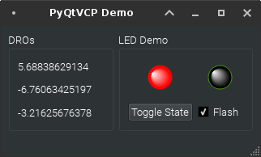

# QtPyVCP: Qt and Python based VCP toolkit for LinuxCNC

QtPyVCP is a PyQt5-based framework for building Virtual Control Panels (VCPs)
for the [LinuxCNC][linuxcnc] machine controller. The goal is to provide a no-code,
drag-and-drop system for making simple VCPs, as well as an easy to use and expendable
python framework for building complex VCPs.

QtPyVCP is designed with the philosophy that it is impossible to predict and
satisfy everyones needs, but it _is_ possible to make it easy(er) for people to
satisfy their own needs. Hence QtPyVCP's goal is to pride a rich set of utilities
and basic widgets that can easily be built on, extended and combined, with 
minimal (if any) python code to create a fully custom VCP.

## Prerequisites
  * LinuxCNC ~2.8pre (master)
  * Python 2.7
  * Qt 5
  * PyQt 5

## Dependencies

### For production use (non development)
`sudo apt-get install python-pyqt5`  
Additional dependencies may be needed depending on the particular VCP that is
is being used. These may be listed in the docs for VCP. If not the error messages
should clearly indicate what packages are missing, and in most cases will give
the exact command for installing the package on Debian based systems.

### For QtPyVCP and VCP development
`sudo apt-get install qttools5-dev-tools`  
`sudo apt-get install qttools5.dev`  
`sudo apt-get install pyqt5-dev-tools`  

## QtDesigner Plug-ins
In order for the QtDesigner plugins to load, you must have the correct version
of `libpyqt5.so` in `/usr/lib/x86_64-linux-gnu/qt5/plugins/designer/`. This library
must be compiled for the specific architecture, Qt version and Python version you
are using. One way to get this file is to build PyQt5 from source, following the
procedure here: https://gist.github.com/KurtJacobson/34a2e45ea2227ba58702fc1cb0372c40

If you can find a pre-compiled version, then you should be able simply place it
in `/usr/lib/x86_64-linux-gnu/qt5/plugins/designer/` and be good to go. A compiled
 version of `libpyqt5.so` suitable for use on a 64bit Debian stretch system
with Python2.7 and Qt 5.7.1 is included in the QtDesigner directory.

## DISCLAIMER

THE AUTHORS OF THIS SOFTWARE ACCEPT ABSOLUTELY NO LIABILITY FOR
ANY HARM OR LOSS RESULTING FROM ITS USE.  IT IS _EXTREMELY_ UNWISE
TO RELY ON SOFTWARE ALONE FOR SAFETY.  Any machinery capable of
harming persons must have provisions for completely removing power
from all motors, etc, before persons enter any danger area.  All
machinery must be designed to comply with local and national safety
codes, and the authors of this software can not, and do not, take
any responsibility for such compliance.

This software is released under the GPLv2.

[linuxcnc]: http://linuxcnc.org/
