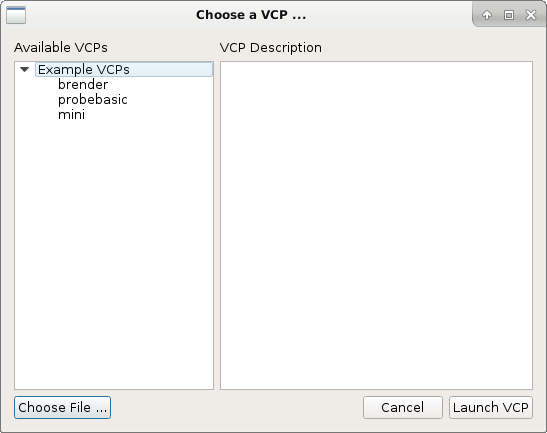

# Basic Usage

At this point you should have the dependencies satisfied and QtPyVCP installed.

## Launching a sim config
Several sim configurations are included with QtPyVCP, they are located
in the project's `sim/` directory. These are intended to be run from a
terminal with the working directory as the project root.

**Available sim configs**
```
sim
├── tool.tbl
├── xyzb.ini
├── xyzcw.ini
├── xyz.ini
├── xyz-metric.ini
└── xyzy-gantry.ini
```

To launch the basic XYZ machine sim run:  
`linuxcnc sim/xyz.ini`

This should start LinuxCNC and show the VCP chooser with a list of
available VCPs.



**Note:** _If there are no VCPs listed, most likely you did not run
`setup.py` per the instillation instructions._

To skip the VCP chooser and launch a VCP directly you can specify the name of
the desired VCP on the command line. For example to launch the Mini VCP:  
`linuxcnc sim/xyz.ini mini`


## INI Configuration

QtPyVCP does not require any special INI settings. To set qtpyvcp as the
GUI simply edit the INIs DISPLAY entry.

```ini
[DISPLAY]
DISPLAY = qtpyvcp
...
```

This will show the VCP chooser every time you start LinuxCNC, but as we saw
above it is possible to specify a specific VCP on the command line. We can
do the same thing in the INI:

```ini
[DISPLAY]
DISPLAY = qtpyvcp mini
...
```

But QtPyVCP supports a bunch of command line options, so this can get messy.
However we can take advantage of the fact that when QtPyVCP starts up it scans
the INI's [DISPLAY] section for any items that match the names of the command
line options, and merges them with any options specified on the command line.

So a better INI config would look like this:
```ini
[DISPLAY]
DISPLAY = qtpyvcp
VCP = mini
...
```


In general the command line options take precedence, meaning they will override
options set in the INI. The exception to this are any flags, such as the
`--fullscreen` option, which if specified in the INI can not be overridden on
the command line.   
